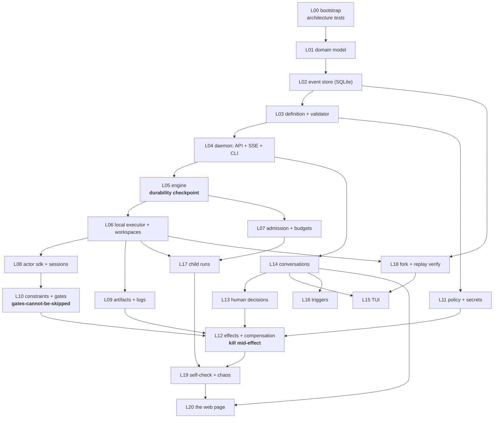

# 10 — Build plan

Four phases. Each has one sentence of goal, the exact scope, **the demo that proves it is done**, and an
honest effort estimate in developer-days for one competent Go developer working with a coding agent —
including tests, because the tests are where the durability claims actually live.

Ranges are not padded: the low end assumes no surprises in the agent-CLI contract, the high end assumes
one.

---

## Before phase 0: a five-day spike you then delete

The single largest risk is not the engine. It is whether you can reliably get **schema-conforming typed
output** out of `claude -p` against a real repo, with session resume, cost accounting, and cancellation
that works. Spend five throwaway days proving that with an in-memory store and no durability, then
**delete it**. If that does not work, nothing downstream matters.

---

## Phase 0 — "One durable run" · ~40 days (32–55)

**Goal:** prove that a typed, event-sourced, gated run executes a real coding agent against a real repo
on this machine, and survives `kill -9`.

**Scope.** Single binary with a daemon/client split over a unix socket · SQLite event store with
conditional append, a schema registry, historical fixtures, two projections, and rebuild-and-diff · pure
`domain.Advance` and the Run/NodeExecution state machines · the engine advance loop, replay,
reconcile-on-startup, and a persisted timer wheel · the local executor (process groups, TERM→KILL,
identity-checked reaping, optional rlimits) · workspaces as `--reference` clones · actor kinds `rule`,
`shell`, and **one** `llm` (Claude Code, reading only the final result — no stream parsing yet) · the file
contract plus `kairos check-output` · JSON-Schema validation both directions · a publish validator subset
· structural and deterministic constraints with one findings adapter, one gate, and findings-as-work with
a loop guard · artifacts and logs on disk · `kairos doctor` · six CLI verbs.

**Out.** Effects, human tasks, conversations, the TUI, triggers, fork, child runs, judged constraints,
the policy engine, the web page, cost accounting, notifications.

**The demo.**
> `kairos run fix-lint.yaml` — an agent works in a clone, `golangci-lint` rejects it with parsed findings,
> the findings become the next attempt's input, the second attempt passes, the run succeeds. Then
> **`kill -9` the daemon mid-agent, restart, and the run completes** while `kairos show` explains every
> transition including the kill. Then `kairos db verify` green and `reindex` byte-identical.

| | days |
| --- | --- |
| bootstrap, config, migrations, CI, the nine architecture tests | 2 |
| domain + state machines + `Advance`, pure | 5 |
| SQLite event store, registry, fixtures, 2 projections, rebuild | 6 |
| definition parsing + schemas + validator subset | 3 |
| daemon (unix socket HTTP + SSE) + CLI client | 3 |
| engine: advance, dispatch, replay, reconciliation | 7 |
| local executor + clone workspaces + reaping | 4 |
| actor SDK: rule/shell/llm, file contract, output ladder | 5 |
| artifacts + logs | 1 |
| constraints slice 1: structural + deterministic, findings, one gate | 3 |
| durability + integration harness | 4 |

**I do not believe this can be halved.** The compressible part is the LLM runner (two days if you shell
out and read only the final JSON). The **incompressible** parts are event-store discipline — schema
registry, fixtures, rebuild — and crash recovery. Shortcuts in the event store are the one category that
is unrecoverable later.

---

## Phase 1 — "It works while I'm not looking" · ~60 days (50–75)

**Goal:** the binary you open in the morning, talk to, walk away from, and trust with your credentials.

**Scope.** Effects and compensation (`git`, `gh`) with `Probe`, `Unknown` recovery, reverse-order
compensation, `idempotencyScope: lineage` · policy file + secrets + the destructive-effect confirmation +
dry-run · constraints completed (judged, panels, waivers, mandatory project gates) · human decisions ·
the Conversation aggregate + the native transport · **the TUI**, including the strict decision view ·
triggers (`cron`, `inbox`, `repo-watch`, `github-issues`, chat) · admission + budget caps + cost
accounting from token streams · the local notifier.

**The demo.**
> You type `kairos`, say *"the orders integration test is flaky, fix it"*, and close the laptop lid. Later
> a desktop notification says a decision is waiting. You open the TUI, read the risk summary, host
> effects, diff, and two open findings **on one screen**, type `approve`, and it pushes a branch and opens
> a PR. Meanwhile a GitHub issue labelled `kairos` started a second run overnight; you `kairos cancel` it
> and **the PR it had already opened is closed by compensation.** `kairos db verify` green throughout, and
> one `kill -9` in the middle changed nothing.

| | days |
| --- | --- |
| policy, secrets, destructive gate, dry-run | 5 |
| effects + compensation + `git`/`gh` providers | 9 |
| constraints slice 2: judged, composite, waivers, mandatory gates | 7 |
| human decisions | 5 |
| conversations + native transport | 6 |
| the TUI (home, chat, decision view, run list) | 12 |
| triggers (five sources) | 6 |
| admission, concurrency, budgets, cost | 4 |
| notifier | 1 |
| integration + chaos-lite | 6 |

**Ordering note that inverts the original:** human decisions ship **before** effects. An irreversible
effect requires a recorded human decision, and with no VM to contain a mistake the confirmation path must
exist before the first destructive effect provider does.

---

## Phase 2 — "Explain it, fork it, trust it" · ~40 days (32–50)

**Goal:** the platform can be interrogated and experimented on, and it proves its own correctness.

**Scope.** Node-boundary workspace snapshots (git refs + CoW trees) · `kairos fork` with prefix copy,
overrides, definition-compatibility diff, and refuse-drift-by-default · replay verification in CI over a
real corpus · `kairos compare` · the debugger (breakpoints, step, variable injection — each an
attributable event) · child runs (spawn/join/`Degraded`/clone inheritance/depth limits/shared-write
lease) · full self-check, the chaos harness at 200 runs, backup and restore-test, `kairos pause`/`park`,
`kairos stats`.

**The demo.**
> A run that failed at node 6 is forked at sequence 5 with `--set actor.implement=sonnet`; both branches
> complete; `kairos compare` shows cost, duration, attempts, and findings side by side; **the fork's PR
> updated the original rather than opening a second one.**
> `git log --graph --all --glob='refs/kairos/**'` shows the tree of every attempt any agent ever made on
> your repo. Replay verification passes over 20 recorded runs and **fails when you inject a deliberate
> impurity.** 200 chaos runs with random kills leave zero orphan processes, zero orphan workspaces, zero
> duplicate PRs.

| | days |
| --- | --- |
| fork + replay verification + compare + debugger | 12 |
| the workspace snapshot mechanism (git plumbing + CoW mode) | 4 |
| child runs + coordination | 9 |
| verify + chaos + backup/restore + stats | 10 |
| corpus lints (8, reduced from 13) | 3 |
| integration | 4 |

---

## Phase 3 — "A window into it" · ~35 days (28–50)

**Goal:** one localhost page for what a terminal is bad at, and a binary a stranger can install.

**Scope.** One merged web app — conversation view with the inline decision card, run list, run detail with
timeline and causal tree including forks, node detail, diff view, findings, fork compare, one stats page ·
packaging (single binary with embedded assets, a Homebrew formula, launchd/systemd user units, first-run
UX) · a docs pass.

**The demo.**
> `brew install kairos && kairos` — it starts, explains itself, and works. `kairos open` shows a
> 500-event run's timeline, the diff of attempt 2 expanded, and two forks side by side without touching
> the CLI. **A colleague installs it on their machine and gets a run to succeed in under ten minutes.**

---

**Total ≈ 175 developer-days**, or eight to nine months solo at a sustainable pace. That is roughly a
quarter of the original corpus's implied scope — which is about right: the distributed half was more than
half the *work* and less than half the *ideas*.

---

## Build order

Twenty-one documents, renumbered. Three of the original twenty-four die outright (machine agent, docker
runtime, firecracker runtime), two merge (the two web UIs), one splits (the API doc → daemon + the
Conversation aggregate), and one is halved (the scheduler → admission only).



Four ordering rules worth stating, each of which was learned the hard way in the original:

1. **L01 before L02.** The domain must be written with no store to depend on. That is how purity gets
   established rather than retrofitted.
2. **L13 before L12.** As above: the human confirmation path precedes the first destructive effect.
3. **Do not let the CLI call the engine in-process "just for phase 0."** The socket boundary in L04 is
   three days, and it is what makes the TUI and the web page *clients* rather than rewrites — and what
   keeps a closed terminal from killing a run.
4. **Do not build L20 early because it is satisfying.**

### The one mechanical decision to get right on day one of L02

Define the projection interface as `Apply(ctx, tx *sql.Tx, ev)` — or your own narrow `Execer` — and
import the SQLite driver from exactly one file. The original leaked `pgx.Tx` into a signature that every
later document implements; the same mistake here would make the driver choice permanent.

---

## The first milestone, precisely

The checkpoint to aim for is L05, and it has **two** tests because `Ctrl-C` and `SIGKILL` are opposite
failures.

```text
TestEngine_survivesKillMidRun          integration; spawns the real binary
TestEngine_ctrlCInterruptsThenResumes  integration
TestExecutor_childInOwnProcessGroup    unit — the invariant keeper
TestReconcile_rebootInvalidatesRecordedPGIDs
TestEngine_nonIdempotentNodeParksAfterRestart
```

**The problem, stated exactly.** `SIGKILL` to the daemon does *not* signal children: they reparent and
keep running, and if their stdout were a pipe whose reader just closed they would die messily with their
output lost. `Ctrl-C` sends `SIGINT` to the whole foreground **process group**, so if children shared the
daemon's group they would die instantly, mid-write. And in *both* cases you cannot `wait4()` a process you
did not fork, so a restarted daemon cannot recover an inherited child's exit status.

**The resolution.** Children get their own process group (so `Ctrl-C` does not reach them and the daemon
decides their fate), their output goes to files (so a killed attempt's evidence survives and adoption is
possible), and on `SIGINT`/`SIGTERM` the daemon **records `node.execution.interrupted` before it kills**.
A restart should never have to *guess* whether a node was interrupted.

For the interrupted node itself, re-running is the phase-0 answer and adoption is the phase-1 upgrade —
gated by declaration, not hope:

```yaml
restartPolicy: rerun          # default when sideEffectFree: true
              | adopt         # re-attach to a surviving process; needs the exit-status file
              | fail-to-human # default when sideEffectFree is unset or false
```

A node that performed an unrecorded, non-idempotent side effect is **not** silently re-run; the run parks
and asks. Adoption is the right end state for a 20-minute Claude session — re-running one costs real money
— but it introduces a *second source of truth about liveness* (`/proc` and the log), and L05 exists to
establish that **the log is the truth**. So: rerun in L05, where the milestone run is `rule` and `shell`
nodes and re-running costs nothing, and adopt in L06 with its own test, once the reconciliation loop it
plugs into is proven.

**The test, mechanically.** A four-node workflow: `n1` a rule; `n2` a shell node that writes its own pid
to a file, sleeps 30s, then writes output; `n3` a shell node that appends one line to a ledger **guarded
by its idempotency key** — the exactly-once probe; `n4` terminal.

1. Start the real binary on a temp data dir; poll readiness.
2. Publish, start a run, subscribe to SSE, block until `node.execution.started{n2}`; record its sequence
   and pgid; independently read the child's pid from the file it wrote.
3. `SIGKILL` the daemon. Assert the wait status is `signaled`.
4. **Assert the mess exists**, proving the test tests something: the child from step 2 is **still alive**.
   If it is already dead here, the executor is leaking shared-process-group behaviour and the test must
   fail *with that diagnosis*.
5. Restart. Assert readiness flips only **after** `engine.reconciled` appears — read the event first, then
   assert readiness, in that order.
6. Assert by **event**, not by outcome: `process.orphan.reaped{pgid}` exists **and** the orphan is now
   `ESRCH` — killed by the *new* process, from the log alone. `node.execution.lost{n2, attempt: 1}`
   exists. `node.execution.started{n2, attempt: 2}` exists at a higher sequence.
7. Poll to terminal: `run.succeeded`.
8. Assert on the log: sequences exactly `1..N`, gapless, no duplicates. `n3` succeeded **once** and
   *started* once.
9. Assert on the world: the ledger has exactly one line; `attempt-1/` still exists with non-empty
   `stdout.log` recorded as an artifact (**evidence of the killed attempt is retained**); `attempt-2/` is
   a *different directory*; no process remains whose pgid appears in any spawn event; the scratch dir is
   empty.
10. **The assertion that is the real point:** replay the log into fresh state and diff it against the
    projection. Empty. Durability that does not reproduce the same state on replay is not durability.

`TestEngine_ctrlCInterruptsThenResumes` differs at steps 3–6 only: `SIGINT` to the whole group, exactly as
a terminal does; assert the daemon exits **0 within 5s**; assert `node.execution.interrupted{n2}` is in the
log **without a restart having happened**; assert the child is dead *before* restart. This is the test that
proves the process-group decision — without it, the child dies from the group signal before the daemon can
record anything, and the `interrupted` event is never written.

`TestReconcile_rebootInvalidatesRecordedPGIDs` seeds a log with an executing node whose spawn event records
a stale boot id, injects a boot-id provider returning a new one, and asserts that reconciliation records
`unverifiable` **and — via an injected killer spy — that `kill` was never called.** Signalling a recycled
pgid after a reboot means killing a stranger's process tree, and no other test catches it.

---

## The corpus lints

Thirteen reduce to eight. They are docs-hygiene checks over a corpus about to shrink by a third, and the
original's own rule applies: a lint with no history of catching anything should be deleted.

**Keep:** links resolve (renumbering breaks links wholesale — and keep the two hard-won implementation
notes: skip fenced blocks, require the closing paren, because Go generics look like markdown links) ·
required document sections · **invariants consistent** (merging three lints into one) · **invariant test
names** (the only thing keeping invariants and implementation docs honest — re-run it after the cull, since
~15 invariants die with the scheduler and machines) · **CLI verbs** (*more* valuable now: the CLI is the
product, not an operator afterthought) · migration numbering · no orphan docs · **limitation entries**
(merging three into one per-entry check).

**Delete:** the metric registry lint — the observability document ceases to be a registry, so there is
nothing to check against.

And keep both meta-rules, because both were paid for: **lint per entry, not per line**, and **run a new
lint against the whole corpus before specifying it** — two of the originals were specified in a form that
failed on the very documents they existed to protect.
